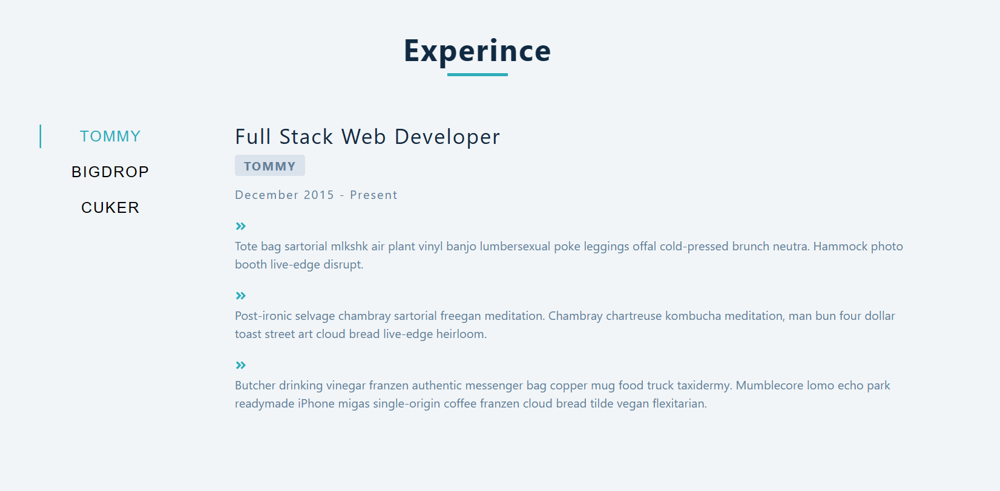
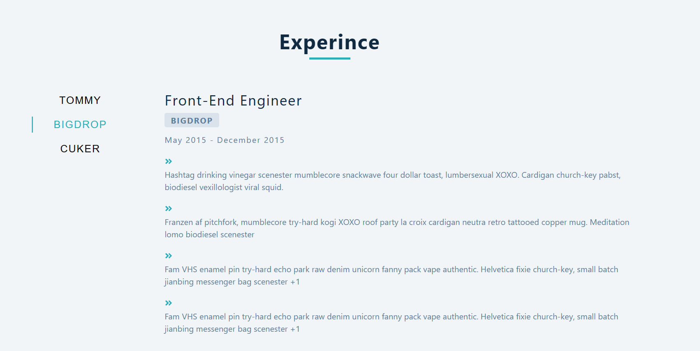

# Taps Project
Welcome to the Taps Project, a small React application that leverages the power of React hooks (useEffect and useState) to fetch and display data from an external API. This project is designed to switch between different jobs, dynamically fetching and displaying relevant data upon user interaction.

## Technologies Used
React

## Live View 
https://thunderous-croquembouche-5a225c.netlify.app

## Design

